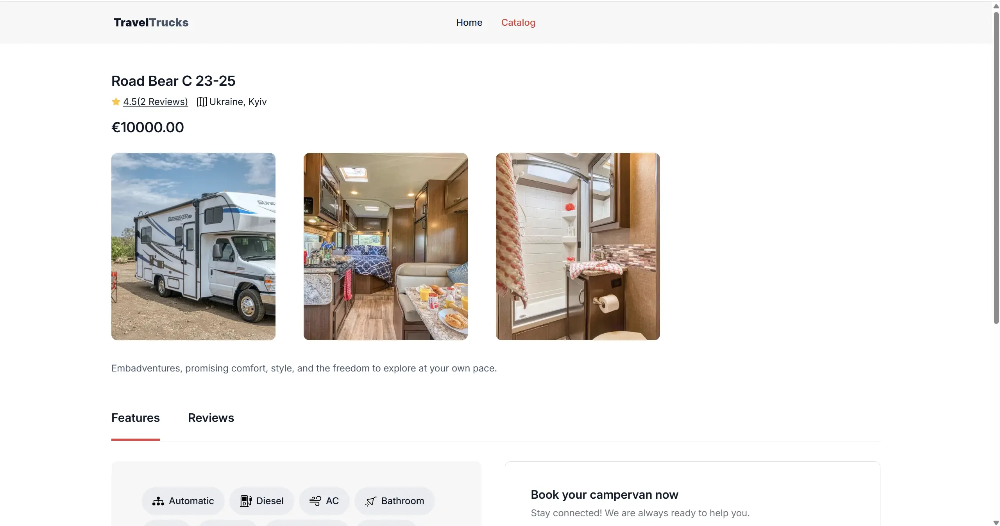

# Campers Project 🌄🏕️⛺🚙🏔️🌊

## **Author**

[illia-dp](https://github.com/illia-dp)

## **Used Libraries**

- **@reduxjs/toolkit** — for state management.
- **axios** — for making HTTP requests.
- **clsx** — for conditional class names.
- **formik** — for handling forms.
- **modern-normalize** — for normalizing styles.
- **react** — the core library for building user interfaces.
- **react-datepicker** — for date picker component.
- **react-dom** — for DOM rendering.
- **react-hot-toast** — for beautiful toast notifications.
- **react-icons** — for icons.
- **react-redux** — for Redux integration.
- **react-router-dom** — for routing.
- **react-spinners** — for displaying loading spinners.
- **react-svg** — for handling SVG files.
- **redux-persist** — for persisting Redux state.
- **yup** — for data validation.

## **Installation and Setup**

1. 📦 Clone the repository using Git:  
   `git clone https://github.com/illia-dp/Campers.git`
2. 🔧 Install dependencies:  
   `npm install` or `yarn install`
3. 💻 Configure the project by editing the `vite.config.js` file.
4. 🚀 Run the project locally:  
   `npm run dev` or `yarn dev`

## **Campers: Where Creativity Meets Adventure**

Welcome to Campers — a React-powered project where imagination runs wild, and coding becomes an art form!

## **Campers' Tech Stack**

We stick to reliable and time-tested tools. Our tech roster includes:

- **React**: Our trusty library for building innovative user interfaces.
- **Vite**: Our fast tool for rapid development and deployment.
- **ESLint**: Our coding camp counselor, keeping our code neat and tidy.
- **TypeScript**: Coming soon for enhanced type safety (stay tuned!).

---

## Home Page 🏠

The Home Page is the main entry point to the project, providing a welcoming interface and easy navigation.

---

## Catalog Page 📑

The Catalog Page allows users to search for campers based on various parameters. You can also save campers to your favorites and click on the "More Info" button to navigate to the Details Page.

---

## Details Page 📄

On the Details Page, you'll find detailed information about a specific camper. It also includes two nested routes for the camper's details and reviews. Additionally, there's a booking form for reservations.

---

## **Advanced URL Parameter Handling** 🌐

Our application makes extensive use of **URL parameters** for dynamic query management and advanced filtering. This allows users to directly interact with the application by modifying the URL to reflect specific search criteria or form inputs. This approach provides a seamless user experience, akin to professional websites that allow bookmarking, sharing, and revisiting specific app states without losing context.

### Key Features:

- **Dynamic Search and Filtering**: URL parameters are utilized to reflect the search criteria, enabling users to bookmark or share search results.
- **Form Data Persistence**: When users interact with the form (for example, booking a camper), the filled form values are reflected in the URL, allowing users to revisit or share the exact state of the form.
- **Deep Linking**: Each state of the application (such as filtered catalogs or selected camper details) has its own unique URL, enabling deep linking to specific pages or sections.

This method enhances the usability and functionality of the application by leveraging the full power of the browser's URL and history management, which is a standard practice in modern web applications.

---

## **Responsive Design and Mobile Optimization** 📱💻

The application is fully **responsive**, providing a seamless experience across various screen sizes. For tablets and mobile devices, we've implemented a **filter menu** that allows users to easily refine their search. On mobile, an additional **navigation menu** ensures smooth browsing and access to different pages.

To optimize the user interface, the **filter panel** is **animated**—filters appear dynamically based on the selected criteria, preventing the filter list from overwhelming the user and ensuring a cleaner, more intuitive design.
